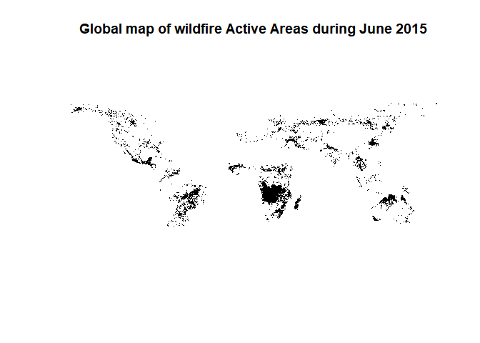
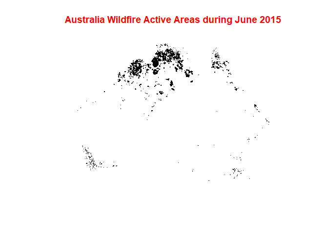
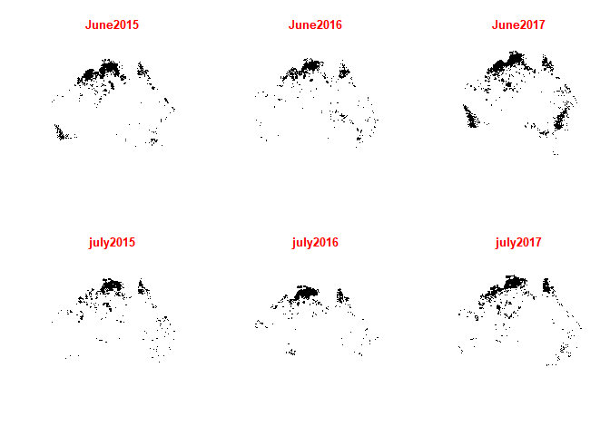

Wild Fire Project 2020; Stephan Schneider, Maximilian Amberg, and Surya Gupta
================

Course name: Hacking for Social Sciences - An Applied Guide to Programming with Data 

To read the description of the dataset, please follow this paper [A global wildfire dataset for the analysis of fire regimes and fire behaviour](https://www.nature.com/articles/s41597-019-0312-2).

We used the global wildfire dataset processed by  Artés et al., 2019. The main objective of this project was:
a) to learn Github. Specifically how to clone a repository, how to commit, how to work in a team using Github.
b) to learn the use of R for the spatial dataset.
c) to find the changes in the patterns of wildfire between 2000 to 2018 for Australia. 


## Downloaded bulk data of wild fire

``` r
setwd("E:/Wild_fire_project/Unzip_file")
getwd() 
```

    ## [1] "E:/Wild_fire_project/Unzip_file"

``` r
#Working directory Structure
  #Working Directory: Wildfire
    #Folder: Raw_Data [do not write in this folder when processing data]
      #contains "Source/Artes-Vivancos_San-Miguel_2018"
      #contains downloaded data
    #Folder: Processed_Data [used to work with data]

# Downloaded bulk data of wild fire-----

library(data.table)
library(tidyverse)
```

    ## -- Attaching packages ---------------------------------------------------------------------------------------------------- tidyverse 1.3.0 --

    ## v ggplot2 3.3.2     v purrr   0.3.4
    ## v tibble  3.0.1     v dplyr   1.0.0
    ## v tidyr   1.1.0     v stringr 1.4.0
    ## v readr   1.3.1     v forcats 0.5.0

    ## -- Conflicts ------------------------------------------------------------------------------------------------------- tidyverse_conflicts() --
    ## x dplyr::between()   masks data.table::between()
    ## x dplyr::filter()    masks stats::filter()
    ## x dplyr::first()     masks data.table::first()
    ## x dplyr::lag()       masks stats::lag()
    ## x dplyr::last()      masks data.table::last()
    ## x purrr::transpose() masks data.table::transpose()

``` r
library(rgdal)
```

    ## Loading required package: sp

    ## rgdal: version: 1.5-12, (SVN revision 1018)
    ## Geospatial Data Abstraction Library extensions to R successfully loaded
    ## Loaded GDAL runtime: GDAL 3.0.4, released 2020/01/28
    ## Path to GDAL shared files: C:/Users/guptasu.D/Documents/R/win-library/3.6/rgdal/gdal
    ## GDAL binary built with GEOS: TRUE 
    ## Loaded PROJ runtime: Rel. 6.3.1, February 10th, 2020, [PJ_VERSION: 631]
    ## Path to PROJ shared files: C:/Users/guptasu.D/Documents/R/win-library/3.6/rgdal/proj
    ## Linking to sp version:1.4-2
    ## To mute warnings of possible GDAL/OSR exportToProj4() degradation,
    ## use options("rgdal_show_exportToProj4_warnings"="none") before loading rgdal.

``` r
library(rgeos)
```

    ## rgeos version: 0.5-5, (SVN revision 640)
    ##  GEOS runtime version: 3.8.0-CAPI-1.13.1 
    ##  Linking to sp version: 1.4-2 
    ##  Polygon checking: TRUE

``` r
library(raster)# for metadata/attributes- vectors or rasters
```

    ## 
    ## Attaching package: 'raster'

    ## The following object is masked from 'package:dplyr':
    ## 
    ##     select

    ## The following object is masked from 'package:tidyr':
    ## 
    ##     extract

    ## The following object is masked from 'package:data.table':
    ## 
    ##     shift

``` r
library(dplyr)
library(dbplyr)
```

    ## 
    ## Attaching package: 'dbplyr'

    ## The following objects are masked from 'package:dplyr':
    ## 
    ##     ident, sql

``` r
library(ggplot2)
library(sf)
```

    ## Linking to GEOS 3.8.0, GDAL 3.0.4, PROJ 6.3.1

``` r
library(raster)
# Read a text file

Wild_fire<-read.delim("Raw_Data/Source/Artes-Vivancos_San-Miguel_2018/datasets/ESRI-GIS_GWIS_wildfire.tab", header = FALSE, sep = "\t")
#Wild_fire<-read.delim("C:/Users/guptasu.D/Downloads/Artes-Vivancos_San-Miguel_2018/datasets/ESRI-GIS_GWIS_wildfire.tab", header = FALSE, sep = "\t")

# Extracted the rows that contain URLs

Wild_fire_url<- Wild_fire[grepl("http", Wild_fire$V1),]

Wild_fire_url1<- Wild_fire_url$V1

typeof(Wild_fire_url1)
```

    ## [1] "integer"

``` r
# Since the data type is an integer, converted it into character

Final_urls<-as.character(Wild_fire_url1)

#Define URLs

urls<-Final_urls

#Define URL folder where to save the data (destination)

data.folder = "./Raw_Data/"  #evtl. mit tab Raw_Data/ auswählen
#data.folder = "E:/Wild_fire_project/Unzip_file/"

#Get file name from url, with file extention

fname.x <- gsub(".*/(.*)", "\\1", urls)

#Get file name from url, without file extention

fname <- gsub("(.*)\\.zip.*", "\\1", fname.x)


destfile = paste0(data.folder, fname.x)

#download files

#for(i in seq_along(urls)){
 # download.file(urls[i], destfile[i], mode="wb")
#}


###
#Download the database
#urldatabase_f="http://hs.pangaea.de/Maps/MCD64A1_burnt-areas/MODIS_GWIS_Final_FireEvents.zip" #final events
#urldatabase_a="http://hs.pangaea.de/Maps/MCD64A1_burnt-areas/MODIS_GWIS_Active_FireEvents.zip" #active areas

#download.file(urldatabase_f, "Raw_Data//MODIS_GWIS_Final_FireEvents.zip", mode="wb")
#download.file(urldatabase_a, "Raw_Data/MODIS_GWIS_Active_FireEvents.zip", mode="wb")

##Unzip files
##for (i in 1:length(destfile)){unzip(destfile[i],exdir=./Raw_Data")}
#tmpdir_R <- tempdir()

##Function to read data into R
from_s <-2015
to_s   <-2017
months_s<-c("6_", "7_") #"1_","2_","3_","4_","5_","6_","7_","8_","9_","10_","11_","12_"
#The following lines define a string vector to load the sample
sampleyears<-seq.int(from_s, to_s, 1)
sampleyears <- as.character(sampleyears) 
sampleym_s<-c(outer(months_s, sampleyears, FUN=paste0)) #"cross-product" of months and years
loadsample<-fname
sampleym_s = paste(sampleym_s, collapse="|")
grepl(sampleym_s, loadsample)
```

    ##   [1] FALSE FALSE FALSE FALSE FALSE FALSE FALSE FALSE FALSE FALSE FALSE FALSE
    ##  [13] FALSE FALSE FALSE FALSE FALSE FALSE FALSE FALSE FALSE FALSE FALSE FALSE
    ##  [25] FALSE FALSE FALSE FALSE FALSE FALSE FALSE FALSE FALSE FALSE FALSE FALSE
    ##  [37] FALSE FALSE FALSE FALSE FALSE FALSE FALSE FALSE FALSE FALSE FALSE FALSE
    ##  [49] FALSE FALSE FALSE FALSE FALSE FALSE FALSE FALSE FALSE FALSE FALSE FALSE
    ##  [61] FALSE FALSE FALSE FALSE FALSE FALSE FALSE FALSE FALSE FALSE FALSE FALSE
    ##  [73] FALSE FALSE FALSE FALSE FALSE FALSE FALSE FALSE FALSE FALSE FALSE FALSE
    ##  [85] FALSE FALSE FALSE FALSE FALSE FALSE FALSE FALSE FALSE FALSE FALSE FALSE
    ##  [97] FALSE FALSE FALSE FALSE FALSE FALSE FALSE FALSE FALSE FALSE FALSE FALSE
    ## [109] FALSE FALSE FALSE FALSE FALSE FALSE FALSE FALSE FALSE FALSE FALSE FALSE
    ## [121] FALSE FALSE FALSE FALSE FALSE FALSE FALSE FALSE FALSE FALSE FALSE FALSE
    ## [133] FALSE FALSE FALSE FALSE FALSE FALSE FALSE FALSE FALSE FALSE FALSE FALSE
    ## [145] FALSE FALSE FALSE FALSE FALSE FALSE FALSE FALSE FALSE FALSE FALSE FALSE
    ## [157] FALSE FALSE FALSE FALSE FALSE FALSE FALSE FALSE FALSE FALSE FALSE FALSE
    ## [169] FALSE FALSE FALSE FALSE FALSE FALSE FALSE  TRUE  TRUE FALSE FALSE FALSE
    ## [181] FALSE FALSE FALSE FALSE FALSE FALSE FALSE  TRUE  TRUE FALSE FALSE FALSE
    ## [193] FALSE FALSE FALSE FALSE FALSE FALSE FALSE  TRUE  TRUE FALSE FALSE FALSE
    ## [205] FALSE FALSE FALSE FALSE FALSE FALSE FALSE FALSE

``` r
loadsample <- data.table(loadsample, insample=grepl(sampleym_s, loadsample))
loadsample<-loadsample %>%filter(insample==TRUE)
loadsample<-loadsample$loadsample


   # for(z in loadsample){ #Loop to load shapefiles into R
      #Unzip downloaded data
      #(zipfile<-str_c(file.path("./Raw_Data//"),z,".zip"))
      #unzip(zipfile, exdir = tmpdir_R)
      #Untar downloaded data (use/modify the next two lines if you want to untar to your disk)
      #untar(tarfile = file.path(tempd1, "/",z,".tar"), exdir = "./Raw_Data/Extracted/")
      #testdatashp <- readOGR(dsn = "./Raw_Data/Extracted", "MODIS_BA_GLOBAL_1_1_2001") 
      #(tarfile<-str_c(file.path(tmpdir_R),"\\",z,".tar"))
      #untar(tarfile = tarfile, exdir = tmpdir_R)
      #Read into R

      #assign(paste(z,"_shp",sep = ""),
             #readOGR(dsn = tmpdir_R, z)) #path, filename (here identical))    
    #}
    #unlink(tmpdir_R) #deletes tempfile. Does that work?
    
##Untar files
    
    for(z in loadsample){ #Loop to load shapefiles into R
      #Unzip downloaded data
      (tarfile<-str_c(file.path("./Raw_Data"),"\\",z,".tar"))
      untar(tarfile =tarfile,files = NULL, list = FALSE, exdir = "./Raw_Data/data/")}

      

## crop single shapefile
## read a shapefile
    
shp_spdf <-readOGR ("./Raw_Data/data/MODIS_BA_GLOBAL_1_6_2015.shp")
```

    ## OGR data source with driver: ESRI Shapefile 
    ## Source: "E:\Wild_fire_project\Unzip_file\Raw_Data\data\MODIS_BA_GLOBAL_1_6_2015.shp", layer: "MODIS_BA_GLOBAL_1_6_2015"
    ## with 351424 features
    ## It has 4 fields

``` r
plot (shp_spdf, main="Global map of wildfire during June 2015", col.main= "red")
```

<!-- -->

``` r
## we gave here bounding box to crop Australia (please follow this website to extract the bounding box:
#https://gist.github.com/graydon/11198540
## We choose bounding box because when we were cropping using Australia shapefile, it was very time-consuming.   

## Cropped shapefiles

sub_Australia <- crop(shp_spdf, extent(113.338953078,153.569469029, -43.6345972634, -10.6681857235))

plot(sub_Australia)
```

<!-- -->

``` r
## Write shapefile

Aus1<- shapefile(sub_Australia,"./Raw_Data/data/Austest1.shp" )

## Crop multiple shapefiles

ipath <- "./Raw_Data/data/"
opath <- "./Raw_Data/data/Aus_extract/"

## extract all shapefiles from the folder

ff <- list.files(ipath, pattern="\\.shp$", full.names=TRUE)

stopifnot(length(ff)>0)

fname.x1 <- gsub(".*/(.*)", "\\1", ff)

#Get file name from url, without file extention

fname1 <- gsub("(.*)\\.shp.*", "\\1", fname.x1)

#define destination folder

destfile1 = paste0(opath, fname.x1)


for (f in 1:length(ff)){
  
  r <- shapefile(ff[f])

  rc <- crop(r, extent(113.338953078,153.569469029, -43.6345972634, -10.6681857235))

  shapefile(rc, destfile1[f], overwrite=TRUE)
  
}


Aus1<- readOGR("./Raw_Data/data/Aus_extract/MODIS_BA_GLOBAL_1_6_2015.shp")
```

    ## OGR data source with driver: ESRI Shapefile 
    ## Source: "E:\Wild_fire_project\Unzip_file\Raw_Data\data\Aus_extract\MODIS_BA_GLOBAL_1_6_2015.shp", layer: "MODIS_BA_GLOBAL_1_6_2015"
    ## with 51332 features
    ## It has 4 fields

``` r
Aus2<- readOGR("./Raw_Data/data/Aus_extract/MODIS_BA_GLOBAL_1_6_2016.shp")
```

    ## OGR data source with driver: ESRI Shapefile 
    ## Source: "E:\Wild_fire_project\Unzip_file\Raw_Data\data\Aus_extract\MODIS_BA_GLOBAL_1_6_2016.shp", layer: "MODIS_BA_GLOBAL_1_6_2016"
    ## with 20595 features
    ## It has 4 fields

``` r
Aus3<- readOGR("./Raw_Data/data/Aus_extract/MODIS_BA_GLOBAL_1_6_2017.shp")
```

    ## OGR data source with driver: ESRI Shapefile 
    ## Source: "E:\Wild_fire_project\Unzip_file\Raw_Data\data\Aus_extract\MODIS_BA_GLOBAL_1_6_2017.shp", layer: "MODIS_BA_GLOBAL_1_6_2017"
    ## with 49504 features
    ## It has 4 fields

``` r
Aus4<- readOGR("./Raw_Data/data/Aus_extract/MODIS_BA_GLOBAL_1_7_2015.shp")
```

    ## OGR data source with driver: ESRI Shapefile 
    ## Source: "E:\Wild_fire_project\Unzip_file\Raw_Data\data\Aus_extract\MODIS_BA_GLOBAL_1_7_2015.shp", layer: "MODIS_BA_GLOBAL_1_7_2015"
    ## with 21901 features
    ## It has 4 fields

``` r
Aus5<- readOGR("./Raw_Data/data/Aus_extract/MODIS_BA_GLOBAL_1_7_2016.shp")
```

    ## OGR data source with driver: ESRI Shapefile 
    ## Source: "E:\Wild_fire_project\Unzip_file\Raw_Data\data\Aus_extract\MODIS_BA_GLOBAL_1_7_2016.shp", layer: "MODIS_BA_GLOBAL_1_7_2016"
    ## with 24766 features
    ## It has 4 fields

``` r
Aus6<- readOGR("./Raw_Data/data/Aus_extract/MODIS_BA_GLOBAL_1_7_2017.shp")
```

    ## OGR data source with driver: ESRI Shapefile 
    ## Source: "E:\Wild_fire_project\Unzip_file\Raw_Data\data\Aus_extract\MODIS_BA_GLOBAL_1_7_2017.shp", layer: "MODIS_BA_GLOBAL_1_7_2017"
    ## with 39150 features
    ## It has 4 fields

``` r
par(mfrow= c(2,3))

plot(Aus1, main="June2015", col.main= "red")

par(new=FALSE)

plot(Aus2, main="June2016", col.main= "red")

par(new=FALSE)

plot(Aus3, main="June2017", col.main= "red")

par(new=FALSE)

plot(Aus4, main="july2015", col.main= "red")

par(new=FALSE)

plot(Aus5, main="july2016", col.main= "red")

par(new=FALSE)

plot(Aus6, main="july2017", col.main= "red")
```

<!-- -->
