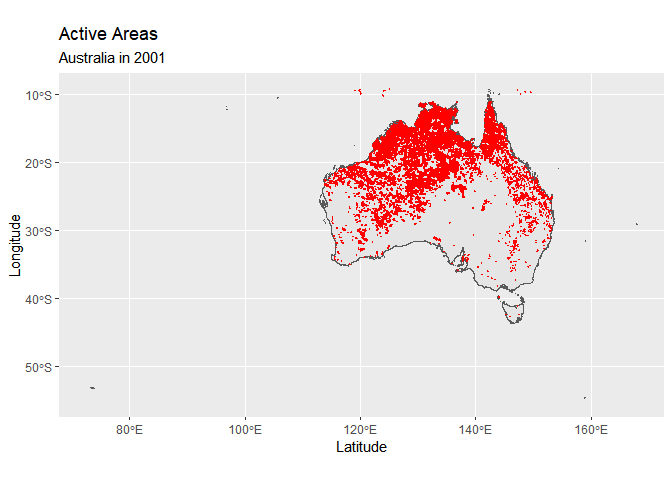

Wild Fire Project 2020
================

  - [Downloaded bulk data of wild
    fire](#downloaded-bulk-data-of-wild-fire)
  - [Processing of data](#processing-of-data)

\#Wild Fire Project 2020

\#Hacking for Social Sciences - An Applied Guide to Programming with
Data\#

# Downloaded bulk data of wild fire

``` r
library(data.table)
library(tidyverse)
```

    ## -- Attaching packages ---------------------------------------------------------------------------------------------------- tidyverse 1.3.0 --

    ## v ggplot2 3.3.2     v purrr   0.3.4
    ## v tibble  3.0.1     v dplyr   1.0.0
    ## v tidyr   1.1.0     v stringr 1.4.0
    ## v readr   1.3.1     v forcats 0.5.0

    ## -- Conflicts ------------------------------------------------------------------------------------------------------- tidyverse_conflicts() --
    ## x dplyr::between()   masks data.table::between()
    ## x dplyr::filter()    masks stats::filter()
    ## x dplyr::first()     masks data.table::first()
    ## x dplyr::lag()       masks stats::lag()
    ## x dplyr::last()      masks data.table::last()
    ## x purrr::transpose() masks data.table::transpose()

``` r
library(rgdal)
```

    ## Loading required package: sp

    ## rgdal: version: 1.5-12, (SVN revision 1018)
    ## Geospatial Data Abstraction Library extensions to R successfully loaded
    ## Loaded GDAL runtime: GDAL 3.0.4, released 2020/01/28
    ## Path to GDAL shared files: C:/Users/guptasu.D/Documents/R/win-library/3.6/rgdal/gdal
    ## GDAL binary built with GEOS: TRUE 
    ## Loaded PROJ runtime: Rel. 6.3.1, February 10th, 2020, [PJ_VERSION: 631]
    ## Path to PROJ shared files: C:/Users/guptasu.D/Documents/R/win-library/3.6/rgdal/proj
    ## Linking to sp version:1.4-2
    ## To mute warnings of possible GDAL/OSR exportToProj4() degradation,
    ## use options("rgdal_show_exportToProj4_warnings"="none") before loading rgdal.

``` r
library(rgeos)
```

    ## rgeos version: 0.5-5, (SVN revision 640)
    ##  GEOS runtime version: 3.8.0-CAPI-1.13.1 
    ##  Linking to sp version: 1.4-2 
    ##  Polygon checking: TRUE

``` r
library(raster)# for metadata/attributes- vectors or rasters
```

    ## 
    ## Attaching package: 'raster'

    ## The following object is masked from 'package:dplyr':
    ## 
    ##     select

    ## The following object is masked from 'package:tidyr':
    ## 
    ##     extract

    ## The following object is masked from 'package:data.table':
    ## 
    ##     shift

``` r
library(dplyr)

# Read a text file

Wild_fire<-read.delim("C:/Users/guptasu.D/Downloads/Artes-Vivancos_San-Miguel_2018/datasets/ESRI-GIS_GWIS_wildfire.tab", header = FALSE, sep = "\t")

# Extracted the rows that contain URLs

Wild_fire_url<- Wild_fire[grepl("http", Wild_fire$V1),]

Wild_fire_url1<- Wild_fire_url$V1

typeof(Wild_fire_url1)
```

    ## [1] "integer"

``` r
# Since the data type is an integer, converted it into character

Final_urls<-as.character(Wild_fire_url1)

#Define URLs

urls<-Final_urls

#Define URL folder where to save the data (destination)

data.folder = "E:/Wild_fire_project/"

#Get file name from url, with file extention

fname.x <- gsub(".*/(.*)", "\\1", urls)

#Get file name from url, without file extention

fname <- gsub("(.*)\\.zip.*", "\\1", fname.x)


destfile = paste0(data.folder, fname.x)

#download files

#for(i in seq_along(urls)){
 # download.file(urls[i], destfile[i], mode="wb")
#}
```

# Processing of data

``` r
#for (i in 1:length(destfile)){unzip(destfile[i],exdir="E:/Wild_fire_project/Unzip_file")}

tmpdir_R <- tempdir()

##Read data into R
  #enter years and months here for which you want to load monthly shapefiles into R
  from_s <-2015
  to_s   <-2017
  months_s<-c("6_","7_") #"1_","2_","3_","4_","5_","6_","7_","8_","9_","10_","11_","12_"
  #The following lines define a string vector to load the sample
    sampleyears<-seq.int(from_s, to_s, 1)
    sampleyears <- as.character(sampleyears) 
    sampleym_s<-c(outer(months_s, sampleyears, FUN=paste0)) #"cross-product" of months and years
    loadsample<-fname
    sampleym_s = paste(sampleym_s, collapse="|")
    grepl(sampleym_s, loadsample)
```

    ##   [1] FALSE FALSE FALSE FALSE FALSE FALSE FALSE FALSE FALSE FALSE FALSE FALSE
    ##  [13] FALSE FALSE FALSE FALSE FALSE FALSE FALSE FALSE FALSE FALSE FALSE FALSE
    ##  [25] FALSE FALSE FALSE FALSE FALSE FALSE FALSE FALSE FALSE FALSE FALSE FALSE
    ##  [37] FALSE FALSE FALSE FALSE FALSE FALSE FALSE FALSE FALSE FALSE FALSE FALSE
    ##  [49] FALSE FALSE FALSE FALSE FALSE FALSE FALSE FALSE FALSE FALSE FALSE FALSE
    ##  [61] FALSE FALSE FALSE FALSE FALSE FALSE FALSE FALSE FALSE FALSE FALSE FALSE
    ##  [73] FALSE FALSE FALSE FALSE FALSE FALSE FALSE FALSE FALSE FALSE FALSE FALSE
    ##  [85] FALSE FALSE FALSE FALSE FALSE FALSE FALSE FALSE FALSE FALSE FALSE FALSE
    ##  [97] FALSE FALSE FALSE FALSE FALSE FALSE FALSE FALSE FALSE FALSE FALSE FALSE
    ## [109] FALSE FALSE FALSE FALSE FALSE FALSE FALSE FALSE FALSE FALSE FALSE FALSE
    ## [121] FALSE FALSE FALSE FALSE FALSE FALSE FALSE FALSE FALSE FALSE FALSE FALSE
    ## [133] FALSE FALSE FALSE FALSE FALSE FALSE FALSE FALSE FALSE FALSE FALSE FALSE
    ## [145] FALSE FALSE FALSE FALSE FALSE FALSE FALSE FALSE FALSE FALSE FALSE FALSE
    ## [157] FALSE FALSE FALSE FALSE FALSE FALSE FALSE FALSE FALSE FALSE FALSE FALSE
    ## [169] FALSE FALSE FALSE FALSE FALSE FALSE FALSE  TRUE  TRUE FALSE FALSE FALSE
    ## [181] FALSE FALSE FALSE FALSE FALSE FALSE FALSE  TRUE  TRUE FALSE FALSE FALSE
    ## [193] FALSE FALSE FALSE FALSE FALSE FALSE FALSE  TRUE  TRUE FALSE FALSE FALSE
    ## [205] FALSE FALSE FALSE FALSE FALSE FALSE FALSE FALSE

``` r
    loadsample <- data.table(loadsample, insample=grepl(sampleym_s, loadsample))
    loadsample<-loadsample %>%filter(insample==TRUE)
    loadsample<-loadsample$loadsample
    
  
 # for(z in loadsample){ #Loop to load shapefiles into R
    #Unzip downloaded data
  #    (tarfile<-str_c(file.path("E:/Wild_fire_project/Unzip_file"),"\\",z,".tar"))
   # untar(tarfile =tarfile,files = NULL, list = FALSE, exdir = "E:/Wild_fire_project/Unzip_file/data")}
    
    ## read a shapefile
    
  shp_spdf <-readOGR ("E:/Wild_fire_project/Unzip_file/data/MODIS_BA_GLOBAL_1_6_2015.shp")
```

    ## OGR data source with driver: ESRI Shapefile 
    ## Source: "E:\Wild_fire_project\Unzip_file\data\MODIS_BA_GLOBAL_1_6_2015.shp", layer: "MODIS_BA_GLOBAL_1_6_2015"
    ## with 351424 features
    ## It has 4 fields

``` r
  plot (shp_spdf)
```

<!-- -->
