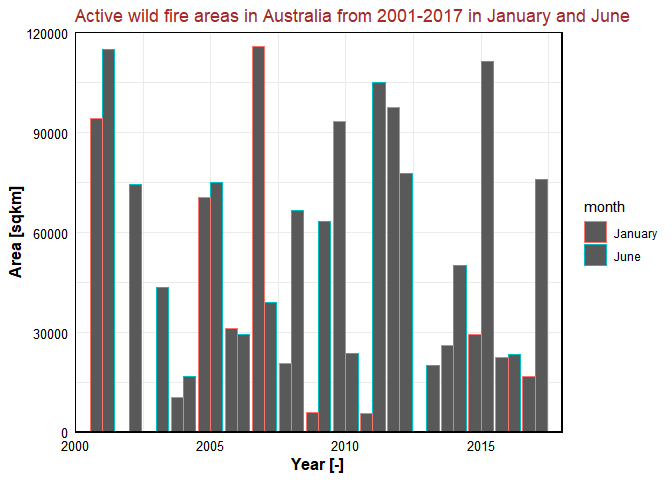
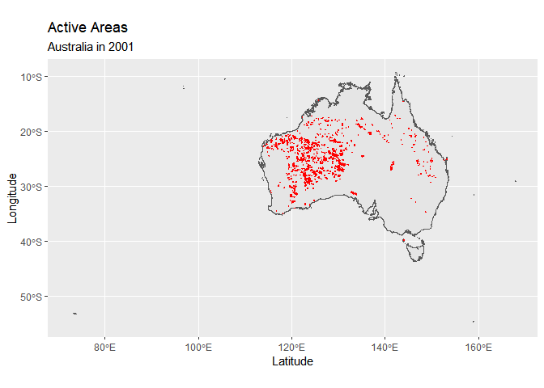

Wild Fire Project 2020
================
Stephan Schneider, Maximilian Amberg, Surya Gupta

  - [Analysis using shapefiles](#analysis-using-shapefiles)

\#Wild Fire Project 2020

Course name: Hacking for Social Sciences - An Applied Guide to
Programming with Data by [Dr. Matthias
Bannert](https://kof.ethz.ch/das-institut/personen/person-detail.MTYxMjA1.TGlzdC81NzgsODQ4OTAwOTg=.html)

To read the description of the dataset, please follow this paper [A
global wildfire dataset for the analysis of fire regimes and fire
behaviour](https://www.nature.com/articles/s41597-019-0312-2).

We used the global wildfire dataset processed by Artés et al., 2019. The
main objective of this project was: to learn Github. Specifically how to
clone a repository, how to commit, how to work in a team using Github,
to learn the use of R for the spatial dataset, to find the changes in
the patterns of wildfire between 2000 to 2018 for Australia, to use to
learn how to send the query for SQL based datasets.

## Analysis using shapefiles

``` r
setwd("E:/Wild_fire_project/Unzip_file")
getwd() 
```

    ## [1] "E:/Wild_fire_project/Unzip_file"

``` r
#Working directory Structure
  #Working Directory: Wildfire
    #Folder: Raw_Data [do not write in this folder when processing data]
      #contains "Source/Artes-Vivancos_San-Miguel_2018"
      #contains downloaded data
    #Folder: Processed_Data [used to work with data]

# Downloaded bulk data of wild fire-----

library(data.table)
library(tidyverse)
```

    ## -- Attaching packages ---------------------------------------------------------------------- tidyverse 1.3.0 --

    ## v ggplot2 3.3.2     v purrr   0.3.4
    ## v tibble  3.0.1     v dplyr   1.0.0
    ## v tidyr   1.1.0     v stringr 1.4.0
    ## v readr   1.3.1     v forcats 0.5.0

    ## -- Conflicts ------------------------------------------------------------------------- tidyverse_conflicts() --
    ## x dplyr::between()   masks data.table::between()
    ## x dplyr::filter()    masks stats::filter()
    ## x dplyr::first()     masks data.table::first()
    ## x dplyr::lag()       masks stats::lag()
    ## x dplyr::last()      masks data.table::last()
    ## x purrr::transpose() masks data.table::transpose()

``` r
library(rgdal)
```

    ## Loading required package: sp

    ## rgdal: version: 1.5-12, (SVN revision 1018)
    ## Geospatial Data Abstraction Library extensions to R successfully loaded
    ## Loaded GDAL runtime: GDAL 3.0.4, released 2020/01/28
    ## Path to GDAL shared files: C:/Users/guptasu.D/Documents/R/win-library/3.6/rgdal/gdal
    ## GDAL binary built with GEOS: TRUE 
    ## Loaded PROJ runtime: Rel. 6.3.1, February 10th, 2020, [PJ_VERSION: 631]
    ## Path to PROJ shared files: C:/Users/guptasu.D/Documents/R/win-library/3.6/rgdal/proj
    ## Linking to sp version:1.4-2
    ## To mute warnings of possible GDAL/OSR exportToProj4() degradation,
    ## use options("rgdal_show_exportToProj4_warnings"="none") before loading rgdal.

``` r
library(rgeos)
```

    ## rgeos version: 0.5-5, (SVN revision 640)
    ##  GEOS runtime version: 3.8.0-CAPI-1.13.1 
    ##  Linking to sp version: 1.4-2 
    ##  Polygon checking: TRUE

``` r
library(raster)# for metadata/attributes- vectors or rasters
```

    ## 
    ## Attaching package: 'raster'

    ## The following object is masked from 'package:dplyr':
    ## 
    ##     select

    ## The following object is masked from 'package:tidyr':
    ## 
    ##     extract

    ## The following object is masked from 'package:data.table':
    ## 
    ##     shift

``` r
library(dplyr)
library(dbplyr)
```

    ## 
    ## Attaching package: 'dbplyr'

    ## The following objects are masked from 'package:dplyr':
    ## 
    ##     ident, sql

``` r
library(ggplot2)
library(sf)
```

    ## Linking to GEOS 3.8.0, GDAL 3.0.4, PROJ 6.3.1

``` r
library(raster)
# Read a text file

Wild_fire<-read.delim("Raw_Data/Source/Artes-Vivancos_San-Miguel_2018/datasets/ESRI-GIS_GWIS_wildfire.tab", header = FALSE, sep = "\t")
#Wild_fire<-read.delim("C:/Users/guptasu.D/Downloads/Artes-Vivancos_San-Miguel_2018/datasets/ESRI-GIS_GWIS_wildfire.tab", header = FALSE, sep = "\t")

# Extracted the rows that contain URLs

Wild_fire_url<- Wild_fire[grepl("http", Wild_fire$V1),]

Wild_fire_url1<- Wild_fire_url$V1

typeof(Wild_fire_url1)
```

    ## [1] "integer"

``` r
# Since the data type is an integer, converted it into character

Final_urls<-as.character(Wild_fire_url1)

#Define URLs

urls<-Final_urls

#Define URL folder where to save the data (destination)

data.folder = "./Raw_Data/"  #evtl. mit tab Raw_Data/ auswählen
#data.folder = "E:/Wild_fire_project/Unzip_file/"

#Get file name from url, with file extention

fname.x <- gsub(".*/(.*)", "\\1", urls)

#Get file name from url, without file extention

fname <- gsub("(.*)\\.zip.*", "\\1", fname.x)


destfile = paste0(data.folder, fname.x)

#download files

#for(i in seq_along(urls)){
 # download.file(urls[i], destfile[i], mode="wb")
#}


###
#Download the database
#urldatabase_f="http://hs.pangaea.de/Maps/MCD64A1_burnt-areas/MODIS_GWIS_Final_FireEvents.zip" #final events
#urldatabase_a="http://hs.pangaea.de/Maps/MCD64A1_burnt-areas/MODIS_GWIS_Active_FireEvents.zip" #active areas

#download.file(urldatabase_f, "Raw_Data//MODIS_GWIS_Final_FireEvents.zip", mode="wb")
#download.file(urldatabase_a, "Raw_Data/MODIS_GWIS_Active_FireEvents.zip", mode="wb")

# Processing of data--------

##Unzip files
#for (i in 1:length(destfile)){unzip(destfile[i],exdir=./Raw_Data")}

tmpdir_R <- tempdir()

##Function to read data into R
from_s <-2000
to_s   <-2017
months_s<-c("1_") #"1_","2_","3_","4_","5_","6_","7_","8_","9_","10_","11_","12_"
#The following lines define a string vector to load the sample
sampleyears<-seq.int(from_s, to_s, 1)
sampleyears <- as.character(sampleyears) 
sampleym_s<-c(outer(months_s, sampleyears, FUN=paste0)) #"cross-product" of months and years
loadsample<-fname
sampleym_s = paste(sampleym_s, collapse="|")
grepl(sampleym_s, loadsample)
```

    ##   [1]  TRUE FALSE  TRUE FALSE FALSE FALSE FALSE FALSE FALSE FALSE FALSE FALSE
    ##  [13]  TRUE FALSE  TRUE FALSE FALSE FALSE FALSE FALSE FALSE FALSE FALSE FALSE
    ##  [25]  TRUE FALSE  TRUE FALSE FALSE FALSE FALSE FALSE FALSE FALSE FALSE FALSE
    ##  [37]  TRUE FALSE  TRUE FALSE FALSE FALSE FALSE FALSE FALSE FALSE FALSE FALSE
    ##  [49]  TRUE FALSE  TRUE FALSE FALSE FALSE FALSE FALSE FALSE FALSE FALSE FALSE
    ##  [61]  TRUE FALSE  TRUE FALSE FALSE FALSE FALSE FALSE FALSE FALSE FALSE FALSE
    ##  [73]  TRUE FALSE  TRUE FALSE FALSE FALSE FALSE FALSE FALSE FALSE FALSE FALSE
    ##  [85]  TRUE FALSE  TRUE FALSE FALSE FALSE FALSE FALSE FALSE FALSE FALSE FALSE
    ##  [97]  TRUE FALSE  TRUE FALSE FALSE FALSE FALSE FALSE FALSE FALSE FALSE FALSE
    ## [109]  TRUE FALSE  TRUE FALSE FALSE FALSE FALSE FALSE FALSE FALSE FALSE FALSE
    ## [121]  TRUE FALSE  TRUE FALSE FALSE FALSE FALSE FALSE FALSE FALSE FALSE FALSE
    ## [133]  TRUE FALSE  TRUE FALSE FALSE FALSE FALSE FALSE FALSE FALSE FALSE FALSE
    ## [145]  TRUE FALSE  TRUE FALSE FALSE FALSE FALSE FALSE FALSE FALSE FALSE FALSE
    ## [157]  TRUE FALSE  TRUE FALSE FALSE FALSE FALSE FALSE FALSE FALSE FALSE FALSE
    ## [169]  TRUE FALSE  TRUE FALSE FALSE FALSE FALSE FALSE FALSE FALSE FALSE FALSE
    ## [181]  TRUE FALSE  TRUE FALSE FALSE FALSE FALSE FALSE FALSE FALSE FALSE FALSE
    ## [193]  TRUE FALSE  TRUE FALSE FALSE FALSE FALSE FALSE FALSE FALSE FALSE FALSE
    ## [205]  TRUE FALSE FALSE FALSE FALSE FALSE FALSE FALSE

``` r
loadsample <- data.table(loadsample, insample=grepl(sampleym_s, loadsample))
loadsample<-loadsample %>%filter(insample==TRUE)
loadsample<-loadsample$loadsample


   # for(z in loadsample){ #Loop to load shapefiles into R
      #Unzip downloaded data
      #(zipfile<-str_c(file.path("./Raw_Data//"),z,".zip"))
      #unzip(zipfile, exdir = tmpdir_R)
      #Untar downloaded data (use/modify the next two lines if you want to untar to your disk)
      #untar(tarfile = file.path(tempd1, "/",z,".tar"), exdir = "./Raw_Data/Extracted/")
      #testdatashp <- readOGR(dsn = "./Raw_Data/Extracted", "MODIS_BA_GLOBAL_1_1_2001") 
      #(tarfile<-str_c(file.path(tmpdir_R),"\\",z,".tar"))
      #untar(tarfile = tarfile, exdir = tmpdir_R)
      #Read into R

      #assign(paste(z,"_shp",sep = ""),
             #readOGR(dsn = tmpdir_R, z)) #path, filename (here identical))    
    #}
    #unlink(tmpdir_R) #deletes tempfile. Does that work?
    
##Untar files
    
   # for(z in loadsample){ #Loop to load shapefiles into R
      #Unzip downloaded data
    #  (tarfile<-str_c(file.path("./Raw_Data"),"\\",z,".tar"))
     # untar(tarfile =tarfile,files = NULL, list = FALSE, exdir = "./Raw_Data/data/")}

      

## crop single shapefile
## read a shapefile
    
shp_spdf <-readOGR ("./Raw_Data/data/MODIS_BA_GLOBAL_1_6_2015.shp")
```

    ## OGR data source with driver: ESRI Shapefile 
    ## Source: "E:\Wild_fire_project\Unzip_file\Raw_Data\data\MODIS_BA_GLOBAL_1_6_2015.shp", layer: "MODIS_BA_GLOBAL_1_6_2015"
    ## with 351424 features
    ## It has 4 fields

``` r
plot (shp_spdf,main="Global map of wildfire Active Areas during June 2015")
```

<!-- -->

``` r
## we gave here bounding box to crop Australia (please follow this website to extract the bounding box:
#https://gist.github.com/graydon/11198540
## We choose bounding box because when we were cropping using Australia shapefile, it was very time-consuming.   

## Cropped shapefiles

sub_Australia <- crop(shp_spdf, extent(113.338953078,153.569469029, -43.6345972634, -10.6681857235))

plot(sub_Australia, main="Australia Wildfire Active Areas during June 2015", col.main= "red")
```

<!-- -->

``` r
## Write shapefile

Aus1<- shapefile(sub_Australia,"./Raw_Data/data/Austest1.shp",overwrite=TRUE )

## Crop multiple shapefiles

ipath <- "./Raw_Data/data/"
opath <- "./Raw_Data/data/Aus_extract/"

## extract all shapefiles from the folder

ff <- list.files(ipath, pattern="\\.shp$", full.names=TRUE)

stopifnot(length(ff)>0)

fname.x1 <- gsub(".*/(.*)", "\\1", ff)

#Get file name from url, without file extention

fname1 <- gsub("(.*)\\.shp.*", "\\1", fname.x1)

#define destination folder

destfile1 = paste0(opath, fname.x1)


#for (f in 1:length(ff)){
  
 # r <- shapefile(ff[f])

  #rc <- crop(r, extent(113.338953078,153.569469029, -43.6345972634, -10.6681857235))

  #shapefile(rc, destfile1[f], overwrite=TRUE)
  
#}


Aus1<- readOGR("./Raw_Data/data/Aus_extract/MODIS_BA_GLOBAL_1_6_2015.shp")
```

    ## OGR data source with driver: ESRI Shapefile 
    ## Source: "E:\Wild_fire_project\Unzip_file\Raw_Data\data\Aus_extract\MODIS_BA_GLOBAL_1_6_2015.shp", layer: "MODIS_BA_GLOBAL_1_6_2015"
    ## with 51332 features
    ## It has 4 fields

``` r
Aus2<- readOGR("./Raw_Data/data/Aus_extract/MODIS_BA_GLOBAL_1_6_2016.shp")
```

    ## OGR data source with driver: ESRI Shapefile 
    ## Source: "E:\Wild_fire_project\Unzip_file\Raw_Data\data\Aus_extract\MODIS_BA_GLOBAL_1_6_2016.shp", layer: "MODIS_BA_GLOBAL_1_6_2016"
    ## with 20595 features
    ## It has 4 fields

``` r
Aus3<- readOGR("./Raw_Data/data/Aus_extract/MODIS_BA_GLOBAL_1_6_2017.shp")
```

    ## OGR data source with driver: ESRI Shapefile 
    ## Source: "E:\Wild_fire_project\Unzip_file\Raw_Data\data\Aus_extract\MODIS_BA_GLOBAL_1_6_2017.shp", layer: "MODIS_BA_GLOBAL_1_6_2017"
    ## with 49504 features
    ## It has 4 fields

``` r
Aus4<- readOGR("./Raw_Data/data/Aus_extract/MODIS_BA_GLOBAL_1_7_2015.shp")
```

    ## OGR data source with driver: ESRI Shapefile 
    ## Source: "E:\Wild_fire_project\Unzip_file\Raw_Data\data\Aus_extract\MODIS_BA_GLOBAL_1_7_2015.shp", layer: "MODIS_BA_GLOBAL_1_7_2015"
    ## with 21901 features
    ## It has 4 fields

``` r
Aus5<- readOGR("./Raw_Data/data/Aus_extract/MODIS_BA_GLOBAL_1_7_2016.shp")
```

    ## OGR data source with driver: ESRI Shapefile 
    ## Source: "E:\Wild_fire_project\Unzip_file\Raw_Data\data\Aus_extract\MODIS_BA_GLOBAL_1_7_2016.shp", layer: "MODIS_BA_GLOBAL_1_7_2016"
    ## with 24766 features
    ## It has 4 fields

``` r
Aus6<- readOGR("./Raw_Data/data/Aus_extract/MODIS_BA_GLOBAL_1_7_2017.shp")
```

    ## OGR data source with driver: ESRI Shapefile 
    ## Source: "E:\Wild_fire_project\Unzip_file\Raw_Data\data\Aus_extract\MODIS_BA_GLOBAL_1_7_2017.shp", layer: "MODIS_BA_GLOBAL_1_7_2017"
    ## with 39150 features
    ## It has 4 fields

``` r
par(mfrow= c(2,3))

plot(Aus1, main="June2015", col.main= "red")

par(new=FALSE)

plot(Aus2, main="June2016", col.main= "red")

par(new=FALSE)

plot(Aus3, main="June2017", col.main= "red")

par(new=FALSE)

plot(Aus4, main="july2015", col.main= "red")

par(new=FALSE)

plot(Aus5, main="july2016", col.main= "red")

par(new=FALSE)

plot(Aus6, main="july2017", col.main= "red")
```

<!-- -->

``` r
## Area changes from 2001 to 2017 for June month


Aus_2001_6<- readOGR("./Raw_Data/data/Aus_extract/MODIS_BA_GLOBAL_1_6_2001.shp")
```

    ## OGR data source with driver: ESRI Shapefile 
    ## Source: "E:\Wild_fire_project\Unzip_file\Raw_Data\data\Aus_extract\MODIS_BA_GLOBAL_1_6_2001.shp", layer: "MODIS_BA_GLOBAL_1_6_2001"
    ## with 41855 features
    ## It has 4 fields

``` r
Aus_2002_6<- readOGR("./Raw_Data/data/Aus_extract/MODIS_BA_GLOBAL_1_6_2002.shp")
```

    ## OGR data source with driver: ESRI Shapefile 
    ## Source: "E:\Wild_fire_project\Unzip_file\Raw_Data\data\Aus_extract\MODIS_BA_GLOBAL_1_6_2002.shp", layer: "MODIS_BA_GLOBAL_1_6_2002"
    ## with 29454 features
    ## It has 4 fields

``` r
Aus_2003_6<- readOGR("./Raw_Data/data/Aus_extract/MODIS_BA_GLOBAL_1_6_2003.shp")
```

    ## OGR data source with driver: ESRI Shapefile 
    ## Source: "E:\Wild_fire_project\Unzip_file\Raw_Data\data\Aus_extract\MODIS_BA_GLOBAL_1_6_2003.shp", layer: "MODIS_BA_GLOBAL_1_6_2003"
    ## with 25155 features
    ## It has 4 fields

``` r
Aus_2004_6<- readOGR("./Raw_Data/data/Aus_extract/MODIS_BA_GLOBAL_1_6_2004.shp")
```

    ## OGR data source with driver: ESRI Shapefile 
    ## Source: "E:\Wild_fire_project\Unzip_file\Raw_Data\data\Aus_extract\MODIS_BA_GLOBAL_1_6_2004.shp", layer: "MODIS_BA_GLOBAL_1_6_2004"
    ## with 16496 features
    ## It has 4 fields

``` r
Aus_2005_6<- readOGR("./Raw_Data/data/Aus_extract/MODIS_BA_GLOBAL_1_6_2005.shp")
```

    ## OGR data source with driver: ESRI Shapefile 
    ## Source: "E:\Wild_fire_project\Unzip_file\Raw_Data\data\Aus_extract\MODIS_BA_GLOBAL_1_6_2005.shp", layer: "MODIS_BA_GLOBAL_1_6_2005"
    ## with 38865 features
    ## It has 4 fields

``` r
Aus_2006_6<- readOGR("./Raw_Data/data/Aus_extract/MODIS_BA_GLOBAL_1_6_2006.shp")
```

    ## OGR data source with driver: ESRI Shapefile 
    ## Source: "E:\Wild_fire_project\Unzip_file\Raw_Data\data\Aus_extract\MODIS_BA_GLOBAL_1_6_2006.shp", layer: "MODIS_BA_GLOBAL_1_6_2006"
    ## with 21610 features
    ## It has 4 fields

``` r
Aus_2007_6<- readOGR("./Raw_Data/data/Aus_extract/MODIS_BA_GLOBAL_1_6_2007.shp")
```

    ## OGR data source with driver: ESRI Shapefile 
    ## Source: "E:\Wild_fire_project\Unzip_file\Raw_Data\data\Aus_extract\MODIS_BA_GLOBAL_1_6_2007.shp", layer: "MODIS_BA_GLOBAL_1_6_2007"
    ## with 24781 features
    ## It has 4 fields

``` r
Aus_2008_6<- readOGR("./Raw_Data/data/Aus_extract/MODIS_BA_GLOBAL_1_6_2008.shp")
```

    ## OGR data source with driver: ESRI Shapefile 
    ## Source: "E:\Wild_fire_project\Unzip_file\Raw_Data\data\Aus_extract\MODIS_BA_GLOBAL_1_6_2008.shp", layer: "MODIS_BA_GLOBAL_1_6_2008"
    ## with 32766 features
    ## It has 4 fields

``` r
Aus_2009_6<- readOGR("./Raw_Data/data/Aus_extract/MODIS_BA_GLOBAL_1_6_2009.shp")
```

    ## OGR data source with driver: ESRI Shapefile 
    ## Source: "E:\Wild_fire_project\Unzip_file\Raw_Data\data\Aus_extract\MODIS_BA_GLOBAL_1_6_2009.shp", layer: "MODIS_BA_GLOBAL_1_6_2009"
    ## with 37317 features
    ## It has 4 fields

``` r
Aus_2010_6<- readOGR("./Raw_Data/data/Aus_extract/MODIS_BA_GLOBAL_1_6_2010.shp")
```

    ## OGR data source with driver: ESRI Shapefile 
    ## Source: "E:\Wild_fire_project\Unzip_file\Raw_Data\data\Aus_extract\MODIS_BA_GLOBAL_1_6_2010.shp", layer: "MODIS_BA_GLOBAL_1_6_2010"
    ## with 20660 features
    ## It has 4 fields

``` r
Aus_2011_6<- readOGR("./Raw_Data/data/Aus_extract/MODIS_BA_GLOBAL_1_6_2011.shp")
```

    ## OGR data source with driver: ESRI Shapefile 
    ## Source: "E:\Wild_fire_project\Unzip_file\Raw_Data\data\Aus_extract\MODIS_BA_GLOBAL_1_6_2011.shp", layer: "MODIS_BA_GLOBAL_1_6_2011"
    ## with 52772 features
    ## It has 4 fields

``` r
Aus_2012_6<- readOGR("./Raw_Data/data/Aus_extract/MODIS_BA_GLOBAL_1_6_2012.shp")
```

    ## OGR data source with driver: ESRI Shapefile 
    ## Source: "E:\Wild_fire_project\Unzip_file\Raw_Data\data\Aus_extract\MODIS_BA_GLOBAL_1_6_2012.shp", layer: "MODIS_BA_GLOBAL_1_6_2012"
    ## with 45830 features
    ## It has 4 fields

``` r
Aus_2013_6<- readOGR("./Raw_Data/data/Aus_extract/MODIS_BA_GLOBAL_1_6_2013.shp")
```

    ## OGR data source with driver: ESRI Shapefile 
    ## Source: "E:\Wild_fire_project\Unzip_file\Raw_Data\data\Aus_extract\MODIS_BA_GLOBAL_1_6_2013.shp", layer: "MODIS_BA_GLOBAL_1_6_2013"
    ## with 16344 features
    ## It has 4 fields

``` r
Aus_2014_6<- readOGR("./Raw_Data/data/Aus_extract/MODIS_BA_GLOBAL_1_6_2014.shp")
```

    ## OGR data source with driver: ESRI Shapefile 
    ## Source: "E:\Wild_fire_project\Unzip_file\Raw_Data\data\Aus_extract\MODIS_BA_GLOBAL_1_6_2014.shp", layer: "MODIS_BA_GLOBAL_1_6_2014"
    ## with 34381 features
    ## It has 4 fields

``` r
## extract the area of shapefiles

Aus_2001_6$area_sqkm <- area(Aus_2001_6) / 1000000

Aus_2002_6$area_sqkm <- area(Aus_2002_6) / 1000000

Aus_2003_6$area_sqkm <- area(Aus_2003_6) / 1000000

Aus_2004_6$area_sqkm <- area(Aus_2004_6) / 1000000

Aus_2005_6$area_sqkm <- area(Aus_2005_6) / 1000000

Aus_2006_6$area_sqkm <- area(Aus_2006_6) / 1000000

Aus_2007_6$area_sqkm <- area(Aus_2007_6) / 1000000

Aus_2008_6$area_sqkm <- area(Aus_2008_6) / 1000000

Aus_2009_6$area_sqkm <- area(Aus_2009_6) / 1000000

Aus_2010_6$area_sqkm <- area(Aus_2010_6) / 1000000

Aus_2011_6$area_sqkm <- area(Aus_2011_6) / 1000000

Aus_2012_6$area_sqkm <- area(Aus_2012_6) / 1000000

Aus_2013_6$area_sqkm <- area(Aus_2013_6) / 1000000

Aus_2014_6$area_sqkm <- area(Aus_2014_6) / 1000000

Aus1$area_sqkm <- area(Aus1) / 1000000

Aus2$area_sqkm <- area(Aus2) / 1000000

Aus3$area_sqkm <- area(Aus3) / 1000000


Aus_2001_61<- Aus_2001_6@data

Aus_2002_61 <- Aus_2002_6@data

Aus_2003_61 <-Aus_2003_6@data

Aus_2004_61 <- Aus_2004_6@data

Aus_2005_61 <- Aus_2005_6@data

Aus_2006_61 <- Aus_2006_6@data

Aus_2007_61 <- Aus_2007_6@data

Aus_2008_61 <- Aus_2008_6@data

Aus_2009_61 <- Aus_2009_6@data

Aus_2010_61 <- Aus_2010_6@data

Aus_2011_61<- Aus_2011_6@data

Aus_2012_61<- Aus_2012_6@data

Aus_2013_61 <- Aus_2013_6@data

Aus_2014_61 <- Aus_2014_6@data

Aus_2015_61<- Aus1@data

Aus_2016_61 <- Aus2@data

Aus_2017_61 <- Aus3@data


Aus_2001_61_area<- Aus_2001_61 %>%
  summarize_if(is.numeric, sum, na.rm=TRUE)

Aus_2001_61_area $year<- 2001

Aus_2002_61_area<- Aus_2002_61 %>%
  summarize_if(is.numeric, sum, na.rm=TRUE)

Aus_2002_61_area $year<- 2002

Aus_2003_61_area<- Aus_2003_61 %>%
  summarize_if(is.numeric, sum, na.rm=TRUE)

Aus_2003_61_area $year<- 2003

Aus_2004_61_area<- Aus_2004_61 %>%
  summarize_if(is.numeric, sum, na.rm=TRUE)

Aus_2004_61_area $year<- 2004

Aus_2005_61_area<- Aus_2005_61 %>%
  summarize_if(is.numeric, sum, na.rm=TRUE)

Aus_2005_61_area $year<- 2005

Aus_2006_61_area<- Aus_2006_61 %>%
  summarize_if(is.numeric, sum, na.rm=TRUE)

Aus_2006_61_area $year<- 2006

Aus_2007_61_area<- Aus_2007_61 %>%
  summarize_if(is.numeric, sum, na.rm=TRUE)

Aus_2007_61_area $year<- 2007

Aus_2008_61_area<- Aus_2008_61 %>%
  summarize_if(is.numeric, sum, na.rm=TRUE)

Aus_2008_61_area $year<- 2008

Aus_2009_61_area<- Aus_2009_61 %>%
  summarize_if(is.numeric, sum, na.rm=TRUE)

Aus_2009_61_area $year<- 2009


Aus_2010_61_area<- Aus_2010_61 %>%
  summarize_if(is.numeric, sum, na.rm=TRUE)

Aus_2010_61_area $year<- 2010

Aus_2011_61_area<- Aus_2011_61 %>%
  summarize_if(is.numeric, sum, na.rm=TRUE)

Aus_2011_61_area $year<- 2011


Aus_2012_61_area<- Aus_2012_61 %>%
  summarize_if(is.numeric, sum, na.rm=TRUE)

Aus_2012_61_area $year<- 2012

Aus_2013_61_area<- Aus_2013_61 %>%
  summarize_if(is.numeric, sum, na.rm=TRUE)

Aus_2013_61_area $year<- 2013

Aus_2014_61_area<- Aus_2014_61 %>%
  summarize_if(is.numeric, sum, na.rm=TRUE)

Aus_2014_61_area $year<- 2014

Aus_2015_61_area<- Aus_2015_61 %>%
  summarize_if(is.numeric, sum, na.rm=TRUE)

Aus_2015_61_area $year<- 2015

Aus_2016_61_area<- Aus_2016_61 %>%
  summarize_if(is.numeric, sum, na.rm=TRUE)

Aus_2016_61_area $year<- 2016


Aus_2017_61_area<- Aus_2017_61 %>%
  summarize_if(is.numeric, sum, na.rm=TRUE)

Aus_2017_61_area $year<- 2017

Final_dataset<- rbind(Aus_2001_61_area, Aus_2002_61_area, Aus_2003_61_area, Aus_2004_61_area,Aus_2005_61_area, Aus_2006_61_area, Aus_2007_61_area, Aus_2008_61_area, Aus_2009_61_area, Aus_2010_61_area, Aus_2011_61_area, Aus_2012_61_area, Aus_2013_61_area, Aus_2014_61_area, Aus_2015_61_area, Aus_2016_61_area, Aus_2017_61_area)

## Area changes from 2001 to 2017 for June month

Aus_2001_1<- readOGR("./Raw_Data/data/Aus_extract/MODIS_BA_GLOBAL_1_1_2001.shp")
```

    ## OGR data source with driver: ESRI Shapefile 
    ## Source: "E:\Wild_fire_project\Unzip_file\Raw_Data\data\Aus_extract\MODIS_BA_GLOBAL_1_1_2001.shp", layer: "MODIS_BA_GLOBAL_1_1_2001"
    ## with 26940 features
    ## It has 4 fields

``` r
Aus_2002_1<- readOGR("./Raw_Data/data/Aus_extract/MODIS_BA_GLOBAL_1_1_2002.shp")
```

    ## OGR data source with driver: ESRI Shapefile 
    ## Source: "E:\Wild_fire_project\Unzip_file\Raw_Data\data\Aus_extract\MODIS_BA_GLOBAL_1_1_2002.shp", layer: "MODIS_BA_GLOBAL_1_1_2002"
    ## with 41911 features
    ## It has 4 fields

``` r
Aus_2003_1<- readOGR("./Raw_Data/data/Aus_extract/MODIS_BA_GLOBAL_1_1_2003.shp")
```

    ## OGR data source with driver: ESRI Shapefile 
    ## Source: "E:\Wild_fire_project\Unzip_file\Raw_Data\data\Aus_extract\MODIS_BA_GLOBAL_1_1_2003.shp", layer: "MODIS_BA_GLOBAL_1_1_2003"
    ## with 49078 features
    ## It has 4 fields

``` r
Aus_2004_1<- readOGR("./Raw_Data/data/Aus_extract/MODIS_BA_GLOBAL_1_1_2004.shp")
```

    ## OGR data source with driver: ESRI Shapefile 
    ## Source: "E:\Wild_fire_project\Unzip_file\Raw_Data\data\Aus_extract\MODIS_BA_GLOBAL_1_1_2004.shp", layer: "MODIS_BA_GLOBAL_1_1_2004"
    ## with 6493 features
    ## It has 4 fields

``` r
Aus_2005_1<- readOGR("./Raw_Data/data/Aus_extract/MODIS_BA_GLOBAL_1_1_2005.shp")
```

    ## OGR data source with driver: ESRI Shapefile 
    ## Source: "E:\Wild_fire_project\Unzip_file\Raw_Data\data\Aus_extract\MODIS_BA_GLOBAL_1_1_2005.shp", layer: "MODIS_BA_GLOBAL_1_1_2005"
    ## with 22293 features
    ## It has 4 fields

``` r
Aus_2006_1<- readOGR("./Raw_Data/data/Aus_extract/MODIS_BA_GLOBAL_1_1_2006.shp")
```

    ## OGR data source with driver: ESRI Shapefile 
    ## Source: "E:\Wild_fire_project\Unzip_file\Raw_Data\data\Aus_extract\MODIS_BA_GLOBAL_1_1_2006.shp", layer: "MODIS_BA_GLOBAL_1_1_2006"
    ## with 16937 features
    ## It has 4 fields

``` r
Aus_2007_1<- readOGR("./Raw_Data/data/Aus_extract/MODIS_BA_GLOBAL_1_1_2007.shp")
```

    ## OGR data source with driver: ESRI Shapefile 
    ## Source: "E:\Wild_fire_project\Unzip_file\Raw_Data\data\Aus_extract\MODIS_BA_GLOBAL_1_1_2007.shp", layer: "MODIS_BA_GLOBAL_1_1_2007"
    ## with 38865 features
    ## It has 4 fields

``` r
Aus_2008_1<- readOGR("./Raw_Data/data/Aus_extract/MODIS_BA_GLOBAL_1_1_2008.shp")
```

    ## OGR data source with driver: ESRI Shapefile 
    ## Source: "E:\Wild_fire_project\Unzip_file\Raw_Data\data\Aus_extract\MODIS_BA_GLOBAL_1_1_2008.shp", layer: "MODIS_BA_GLOBAL_1_1_2008"
    ## with 9254 features
    ## It has 4 fields

``` r
Aus_2009_1<- readOGR("./Raw_Data/data/Aus_extract/MODIS_BA_GLOBAL_1_1_2009.shp")
```

    ## OGR data source with driver: ESRI Shapefile 
    ## Source: "E:\Wild_fire_project\Unzip_file\Raw_Data\data\Aus_extract\MODIS_BA_GLOBAL_1_1_2009.shp", layer: "MODIS_BA_GLOBAL_1_1_2009"
    ## with 3901 features
    ## It has 4 fields

``` r
Aus_2010_1<- readOGR("./Raw_Data/data/Aus_extract/MODIS_BA_GLOBAL_1_1_2010.shp")
```

    ## OGR data source with driver: ESRI Shapefile 
    ## Source: "E:\Wild_fire_project\Unzip_file\Raw_Data\data\Aus_extract\MODIS_BA_GLOBAL_1_1_2010.shp", layer: "MODIS_BA_GLOBAL_1_1_2010"
    ## with 40154 features
    ## It has 4 fields

``` r
Aus_2011_1<- readOGR("./Raw_Data/data/Aus_extract/MODIS_BA_GLOBAL_1_1_2011.shp")
```

    ## OGR data source with driver: ESRI Shapefile 
    ## Source: "E:\Wild_fire_project\Unzip_file\Raw_Data\data\Aus_extract\MODIS_BA_GLOBAL_1_1_2011.shp", layer: "MODIS_BA_GLOBAL_1_1_2011"
    ## with 3368 features
    ## It has 4 fields

``` r
Aus_2012_1<- readOGR("./Raw_Data/data/Aus_extract/MODIS_BA_GLOBAL_1_1_2012.shp")
```

    ## OGR data source with driver: ESRI Shapefile 
    ## Source: "E:\Wild_fire_project\Unzip_file\Raw_Data\data\Aus_extract\MODIS_BA_GLOBAL_1_1_2012.shp", layer: "MODIS_BA_GLOBAL_1_1_2012"
    ## with 45220 features
    ## It has 4 fields

``` r
Aus_2013_1<- readOGR("./Raw_Data/data/Aus_extract/MODIS_BA_GLOBAL_1_1_2013.shp")
```

    ## OGR data source with driver: ESRI Shapefile 
    ## Source: "E:\Wild_fire_project\Unzip_file\Raw_Data\data\Aus_extract\MODIS_BA_GLOBAL_1_1_2013.shp", layer: "MODIS_BA_GLOBAL_1_1_2013"
    ## with 63526 features
    ## It has 4 fields

``` r
Aus_2014_1<- readOGR("./Raw_Data/data/Aus_extract/MODIS_BA_GLOBAL_1_1_2014.shp")
```

    ## OGR data source with driver: ESRI Shapefile 
    ## Source: "E:\Wild_fire_project\Unzip_file\Raw_Data\data\Aus_extract\MODIS_BA_GLOBAL_1_1_2014.shp", layer: "MODIS_BA_GLOBAL_1_1_2014"
    ## with 15224 features
    ## It has 4 fields

``` r
Aus_2015_1<- readOGR("./Raw_Data/data/Aus_extract/MODIS_BA_GLOBAL_1_1_2015.shp")
```

    ## OGR data source with driver: ESRI Shapefile 
    ## Source: "E:\Wild_fire_project\Unzip_file\Raw_Data\data\Aus_extract\MODIS_BA_GLOBAL_1_1_2015.shp", layer: "MODIS_BA_GLOBAL_1_1_2015"
    ## with 18202 features
    ## It has 4 fields

``` r
Aus_2016_1<- readOGR("./Raw_Data/data/Aus_extract/MODIS_BA_GLOBAL_1_1_2016.shp")
```

    ## OGR data source with driver: ESRI Shapefile 
    ## Source: "E:\Wild_fire_project\Unzip_file\Raw_Data\data\Aus_extract\MODIS_BA_GLOBAL_1_1_2016.shp", layer: "MODIS_BA_GLOBAL_1_1_2016"
    ## with 13034 features
    ## It has 4 fields

``` r
Aus_2017_1<- readOGR("./Raw_Data/data/Aus_extract/MODIS_BA_GLOBAL_1_1_2017.shp")
```

    ## OGR data source with driver: ESRI Shapefile 
    ## Source: "E:\Wild_fire_project\Unzip_file\Raw_Data\data\Aus_extract\MODIS_BA_GLOBAL_1_1_2017.shp", layer: "MODIS_BA_GLOBAL_1_1_2017"
    ## with 10867 features
    ## It has 4 fields

``` r
Aus_2001_1$area_sqkm <- area(Aus_2001_1) / 1000000

Aus_2002_1$area_sqkm <- area(Aus_2002_1) / 1000000

Aus_2003_1$area_sqkm <- area(Aus_2003_1) / 1000000

Aus_2004_1$area_sqkm <- area(Aus_2004_1) / 1000000

Aus_2005_1$area_sqkm <- area(Aus_2005_1) / 1000000

Aus_2006_1$area_sqkm <- area(Aus_2006_1) / 1000000

Aus_2007_1$area_sqkm <- area(Aus_2007_1) / 1000000

Aus_2008_1$area_sqkm <- area(Aus_2008_1) / 1000000

Aus_2009_1$area_sqkm <- area(Aus_2009_1) / 1000000

Aus_2010_1$area_sqkm <- area(Aus_2010_1) / 1000000

Aus_2011_1$area_sqkm <- area(Aus_2011_1) / 1000000

Aus_2012_1$area_sqkm <- area(Aus_2012_1) / 1000000

Aus_2013_1$area_sqkm <- area(Aus_2013_1) / 1000000

Aus_2014_1$area_sqkm <- area(Aus_2014_1) / 1000000

Aus_2015_1$area_sqkm <- area(Aus_2015_1) / 1000000

Aus_2016_1$area_sqkm <- area(Aus_2016_1) / 1000000

Aus_2017_1$area_sqkm <- area(Aus_2017_1) / 1000000


Aus_2001_11<- Aus_2001_1@data

Aus_2002_11 <- Aus_2002_1@data

Aus_2003_11 <-Aus_2003_1@data

Aus_2004_11 <- Aus_2004_1@data

Aus_2005_11 <- Aus_2005_1@data

Aus_2006_11 <- Aus_2006_1@data

Aus_2007_11 <- Aus_2007_1@data

Aus_2008_11 <- Aus_2008_1@data

Aus_2009_11 <- Aus_2009_1@data

Aus_2010_11 <- Aus_2010_1@data

Aus_2011_11<- Aus_2011_1@data

Aus_2012_11<- Aus_2012_1@data

Aus_2013_11 <- Aus_2013_1@data

Aus_2014_11 <- Aus_2014_1@data

Aus_2015_11<- Aus_2015_1@data

Aus_2016_11 <- Aus_2016_1@data

Aus_2017_11 <- Aus_2017_1@data


Aus_2001_11_area<- Aus_2001_11 %>%
  summarize_if(is.numeric, sum, na.rm=TRUE)

Aus_2001_11_area $year<- 2001

Aus_2002_11_area<- Aus_2002_11 %>%
  summarize_if(is.numeric, sum, na.rm=TRUE)

Aus_2002_11_area $year<- 2002

Aus_2003_11_area<- Aus_2003_11 %>%
  summarize_if(is.numeric, sum, na.rm=TRUE)

Aus_2003_11_area $year<- 2003

Aus_2004_11_area<- Aus_2004_11 %>%
  summarize_if(is.numeric, sum, na.rm=TRUE)

Aus_2004_11_area $year<- 2004

Aus_2005_11_area<- Aus_2005_11 %>%
  summarize_if(is.numeric, sum, na.rm=TRUE)

Aus_2005_11_area $year<- 2005

Aus_2006_11_area<- Aus_2006_11 %>%
  summarize_if(is.numeric, sum, na.rm=TRUE)

Aus_2006_11_area $year<- 2006

Aus_2007_11_area<- Aus_2007_11 %>%
  summarize_if(is.numeric, sum, na.rm=TRUE)

Aus_2007_11_area $year<- 2007

Aus_2008_11_area<- Aus_2008_11 %>%
  summarize_if(is.numeric, sum, na.rm=TRUE)

Aus_2008_11_area $year<- 2008

Aus_2009_11_area<- Aus_2009_11 %>%
  summarize_if(is.numeric, sum, na.rm=TRUE)

Aus_2009_11_area $year<- 2009


Aus_2010_11_area<- Aus_2010_11 %>%
  summarize_if(is.numeric, sum, na.rm=TRUE)

Aus_2010_11_area $year<- 2010

Aus_2011_11_area<- Aus_2011_11 %>%
  summarize_if(is.numeric, sum, na.rm=TRUE)

Aus_2011_11_area $year<- 2011


Aus_2012_11_area<- Aus_2012_11 %>%
  summarize_if(is.numeric, sum, na.rm=TRUE)

Aus_2012_11_area $year<- 2012

Aus_2013_11_area<- Aus_2013_11 %>%
  summarize_if(is.numeric, sum, na.rm=TRUE)

Aus_2013_11_area $year<- 2013

Aus_2014_11_area<- Aus_2014_11 %>%
  summarize_if(is.numeric, sum, na.rm=TRUE)

Aus_2014_11_area $year<- 2014

Aus_2015_11_area<- Aus_2015_11 %>%
  summarize_if(is.numeric, sum, na.rm=TRUE)

Aus_2015_11_area $year<- 2015

Aus_2016_11_area<- Aus_2016_11 %>%
  summarize_if(is.numeric, sum, na.rm=TRUE)

Aus_2016_11_area $year<- 2016


Aus_2017_11_area<- Aus_2017_11 %>%
  summarize_if(is.numeric, sum, na.rm=TRUE)

Aus_2017_11_area $year<- 2017

Final_dataset1<- rbind(Aus_2001_11_area, Aus_2002_11_area, Aus_2003_11_area, Aus_2004_11_area, Aus_2005_11_area,Aus_2006_11_area, Aus_2007_11_area, Aus_2008_11_area, Aus_2009_11_area, Aus_2010_11_area, Aus_2011_11_area, Aus_2012_11_area, Aus_2013_11_area, Aus_2014_11_area, Aus_2015_11_area, Aus_2016_11_area, Aus_2017_11_area)

Final_dataset$month<- "June"

Final_dataset1$month<- "January"

Final_dataset2<- rbind(Final_dataset, Final_dataset1)

p<-ggplot(data=Final_dataset2, aes(x=year, y=area_sqkm, color = month)) +
  geom_bar(stat="identity",  position=position_dodge())+ 
  labs(title="Active wild fire areas in Australia from 2001-2017 in January and June", y= "Area [sqkm]", x= "Year [-]") + theme_minimal()+theme(axis.text=element_text(size=10, color = "black"),
                                       axis.title=element_text(size=12,face="bold"))+ theme(plot.title = element_text(color = "brown"))+theme(panel.border = element_rect(colour = "black", fill=NA, size=1))+
  scale_x_continuous(limits = c(2000,2018), expand = c(0, 0)) +
  scale_y_continuous(limits = c(0,120000), expand = c(0, 0)) 

p
```

    ## Warning: Removed 3 rows containing missing values (geom_bar).

<!-- --> \#\# Analysis
using database\_wildfire

``` r
Sys.Date()
```

    ## [1] "2021-02-03"

``` r
# Clear the global environment
rm(list = ls())


### Pre-settings

## Load usual libraries 
library(tidyverse)
library(ggplot2)
library(readxl)
library(writexl)
library(dplyr)
# library(plyr)
# library(forcats)
# library(readxl)
# library(writexl)
# library(haven)
# library(scales)
# library(plm)
# library(data.table)

## Load specific libraries
library(DBI)
library(RPostgres)
library(odbc)
library(sf)
#library(sparklyr)
#library(sparklyr.nested)
#library(Rcpp)


## Set crucial/useful option
#options(na.action = na.warn)    # Option set as such that R will return a warning if there are any missings

# Check working directory

setwd("E:/Wild_fire_project/Unzip_file")
getwd()
```

    ## [1] "E:/Wild_fire_project/Unzip_file"

``` r
### NEXT STEPS
## 1) Need to find out what needs to be specified after "SELECT * FROM nasa_modis_ba.final_ba_2000 ......"
# DONE
## 2) Develop an approach loading several tables/elements (of different years) at once
# DONE
## 3) Find out how to load boundary-data (as wkb-format?)
# DONE
## 4) ???


### SQL queries -------------------------------------------------------------
### TASK:
# The idea is to send the SQL queries as (sanitized) text strings to the DB


### Set up a connection with the gwis database

## Pre-definitions
db_name <- "gwis"
host_name <- "localhost"
username <- "user1"
password <- "1"

## Connect with the gwis database
con <- dbConnect(drv = RPostgres::Postgres(),
                 #RMySQL::MySQL(),   # ?
                 dbname = db_name,
                 host = host_name,         
                 port = 5432,
                 user = username,
                 password = password)  
#dbDisconnect(con)

# Other useful commands
dbListTables(con)
```

    ## [1] "geography_columns" "geometry_columns"  "spatial_ref_sys"

``` r
#dbReadTable(con, "final_ba_2000")
# Fehler: Failed to prepare query: FEHLER:  Relation ?final_ba_2000? existiert nicht
# LINE 1: SELECT * FROM  "final_ba_2000"
# ^


### First tests with limited number of elements loaded
# Final areas
rs1 <- dbSendQuery(con, "SELECT * FROM nasa_modis_ba.final_ba_2000 LIMIT 1")
dbFetch(rs1)     # worked out!
```

    ##   ogc_fid  id initialdate  finaldate
    ## 1      48 289  2000-11-22 2000-12-19
    ##                                                                                                                                                                                                                                                                                                                                                                                                                                                                                                                                                                                                                                                                                                                                                                                                                                                                                                                                                                                                                                                                                                                                                                                                                                                                                                                                                                                                                                                                                                                                                                                                                                                                                                                                                                                                                                                                                                                                                                                                                                                                                                                                                                                                                                                                                                                                                                                                                                                                                                                                                                                                                                                                                                                                                                                                                                                                                                                                                                                                                                                                                                                                                                                                                                                                               geom
    ## 1 0106000020E6100000030000000103000000020000002000000000000000C82854C000000000E0943A4000000000C82854C000000000C0933A4000000000102954C000000000C0933A4000000000102954C000000000E0943A4000000000102954C00000000080953A4000000000182954C00000000080953A4000000000182954C00000000060943A4000000000602954C00000000060943A4000000000602954C000000000E0943A4000000000A02954C000000000E0943A4000000000A02954C00000000080953A4000000000F02954C00000000080953A4000000000F02954C000000000A0963A4000000000A82954C000000000A0963A4000000000A82954C00000000020973A4000000000E82954C00000000020973A4000000000E82954C000000000C0973A4000000000F02954C000000000C0973A4000000000F02954C000000000E0983A4000000000602954C000000000E0983A4000000000602954C00000000040983A4000000000102954C00000000040983A4000000000102954C000000000C0973A4000000000D02854C000000000C0973A4000000000D02854C00000000020973A4000000000C82854C00000000020973A4000000000C82854C000000000A0963A4000000000882854C000000000A0963A4000000000882854C00000000000963A4000000000802854C00000000000963A4000000000802854C000000000E0943A4000000000C82854C000000000E0943A400500000000000000182954C00000000080953A4000000000182954C00000000000963A4000000000582954C00000000000963A4000000000582954C00000000080953A4000000000182954C00000000080953A400103000000010000001300000000000000182954C00000000020A03A4000000000102954C00000000020A03A4000000000102954C000000000009F3A4000000000182954C000000000009F3A4000000000182954C000000000809E3A4000000000602954C000000000809E3A4000000000602954C000000000A09F3A4000000000602954C00000000020A03A4000000000A02954C00000000020A03A4000000000A02954C00000000040A13A4000000000602954C00000000040A13A4000000000602954C000000000E0A13A4000000000582954C000000000E0A13A4000000000582954C00000000060A23A4000000000102954C00000000060A23A4000000000102954C00000000040A13A4000000000182954C00000000040A13A4000000000182954C000000000C0A03A4000000000182954C00000000020A03A400103000000010000002700000000000000A82754C00000000060993A4000000000A82754C00000000040983A4000000000F02754C00000000040983A4000000000F02754C000000000E0983A4000000000F82754C000000000E0983A4000000000F82754C00000000060993A4000000000382854C00000000060993A4000000000802854C00000000060993A4000000000102954C00000000060993A4000000000102954C000000000009A3A4000000000182954C000000000009A3A4000000000182954C000000000209B3A4000000000602954C000000000209B3A4000000000602954C000000000409C3A4000000000182954C000000000409C3A4000000000102954C000000000409C3A4000000000102954C000000000C09C3A4000000000102954C000000000609D3A4000000000182954C000000000609D3A4000000000182954C000000000809E3A4000000000102954C000000000809E3A4000000000102954C000000000009F3A4000000000C82854C000000000009F3A4000000000382854C000000000009F3A4000000000382854C000000000E09D3A4000000000382854C000000000609D3A4000000000F82754C000000000609D3A4000000000F82754C000000000C09C3A4000000000F02754C000000000C09C3A4000000000A82754C000000000C09C3A4000000000A82754C000000000409C3A4000000000682754C000000000409C3A4000000000682754C000000000A09B3A4000000000602754C000000000A09B3A4000000000602754C000000000809A3A4000000000182754C000000000809A3A4000000000182754C00000000060993A4000000000602754C00000000060993A4000000000A82754C00000000060993A40

``` r
# Active areas
rs2 <- dbSendQuery(con, "SELECT * FROM nasa_modis_ba.active_areas_2001 LIMIT 2")
```

    ## Warning in result_create(conn@ptr, statement): Closing open result set,
    ## cancelling previous query

``` r
dbFetch(rs2)     # worked out!
```

    ##   ogc_fid     id   burndate
    ## 1  506003 184077 2001-01-04
    ## 2  506004 184077 2001-01-05
    ##                                                                                                                                                                                                           wkb_geometry
    ## 1 0106000020E61000000100000001030000000100000005000000F5FFFFFFFF8C10C0FAFFFFFF3F202240F5FFFFFF7F8810C0FAFFFFFF3F202240F5FFFFFF7F8810C000000000001E2240F5FFFFFFFF8C10C000000000001E2240F5FFFFFFFF8C10C0FAFFFFFF3F202240
    ## 2 0106000020E61000000100000001030000000100000005000000F5FFFFFF7F8810C0FAFFFFFF3F20224000000000008410C0FAFFFFFF3F20224000000000008410C000000000001E2240F5FFFFFF7F8810C000000000001E2240F5FFFFFF7F8810C0FAFFFFFF3F202240

``` r
### Load data for a map of Australia
library(geojsonsf)
australia_sf <- geojson_sf("./Raw_Data/geojson/2c97c1efc6a175f3c06b62dae125c372.geojson")

# Extract coordinates for the corresponding boundary box
head(australia_sf,3)
```

    ## Simple feature collection with 1 feature and 6 fields
    ## geometry type:  MULTIPOLYGON
    ## dimension:      XY
    ## bbox:           xmin: 72.57811 ymin: -55.11579 xmax: 167.9966 ymax: -9.140693
    ## geographic CRS: WGS 84
    ##       id admin_level parents      name local_name   name_en
    ## 1 -80500           2    <NA> Australia  Australia Australia
    ##                         geometry
    ## 1 MULTIPOLYGON (((158.6844 -5...

``` r
bbox_list <- lapply(st_geometry(australia_sf), st_bbox)
#View(bbox_list)


### Query data for one year only and plot it
# Query it
rs3 <- dbSendQuery(con, "SELECT * FROM nasa_modis_ba.active_areas_2001 WHERE nasa_modis_ba.active_areas_2001.wkb_geometry && ST_MakeEnvelope(72.57811, -55.11579,  167.9966, -9.140693)")
```

    ## Warning in result_create(conn@ptr, statement): Closing open result set,
    ## cancelling previous query

``` r
# Fetch it in an object called dbout (database output)
dbout <- dbFetch(rs3)  
# Add another variable that is a converted version of the wkb_geometry variable (namely a sfc_geometry)
dbout$sfc_geometry <- st_as_sfc(
  dbout$wkb_geometry,
  EWKB = TRUE,
  spatialite = FALSE,
  pureR = FALSE,
  crs = NA_crs_
)

## Normal plot                                                                  # plot works but it takes one or two minutes
#plot(dbout$sfc_geometry)

## Another plot                                                                 # plot works but it takes one or two minutes
# ggplot() +
#  geom_sf(data = dbout$sfc_geometry, colour = 'red') +
#  guides(fill = guide_none())

 #Plot with borders of Australia                                               # plot works but it takes three or four minutes
ggplot(australia_sf) +
 geom_sf() +
  geom_sf(data = dbout$sfc_geometry, colour = 'red') +
 labs(
    title = "Active Areas",
    subtitle = "Australia in 2001",
    x = "Latitude",
    y = "Longitude"
  ) +
   guides(fill = guide_none())
```

<!-- -->

``` r
# Saving only workes if a folder called "maps" is created next to the folder "Raw_Data"
# ggsave("maps/active_areas_Australia_2001.png", width = 8, height = 8, dpi = 300, units = "in")
# However, it takes a while to be able to open it after saving/storing it in the the folder "maps"
# (propably cause its size is too large)


### Two alternatives to load several tables/elements (of different years) at once

### 1. Alternative: Use "UNION ALL" in dbSendQuery()
# Query it
rs <- dbSendQuery(con, 
                  "(SELECT * FROM nasa_modis_ba.active_areas_2001 
                  WHERE nasa_modis_ba.active_areas_2001.wkb_geometry && ST_MakeEnvelope(72.57811, -55.11579,  167.9966, -9.140693))
                  UNION ALL
                  (SELECT * FROM nasa_modis_ba.active_areas_2002
                  WHERE nasa_modis_ba.active_areas_2002.wkb_geometry && ST_MakeEnvelope(72.57811, -55.11579,  167.9966, -9.140693))
                  UNION ALL
                  (SELECT * FROM nasa_modis_ba.active_areas_2003
                  WHERE nasa_modis_ba.active_areas_2003.wkb_geometry && ST_MakeEnvelope(72.57811, -55.11579,  167.9966, -9.140693))
                  UNION ALL
                  (SELECT * FROM nasa_modis_ba.active_areas_2004
                  WHERE nasa_modis_ba.active_areas_2004.wkb_geometry && ST_MakeEnvelope(72.57811, -55.11579,  167.9966, -9.140693))
                  UNION ALL
                  (SELECT * FROM nasa_modis_ba.active_areas_2005
                  WHERE nasa_modis_ba.active_areas_2005.wkb_geometry && ST_MakeEnvelope(72.57811, -55.11579,  167.9966, -9.140693))
                  UNION ALL
                  (SELECT * FROM nasa_modis_ba.active_areas_2006
                  WHERE nasa_modis_ba.active_areas_2006.wkb_geometry && ST_MakeEnvelope(72.57811, -55.11579,  167.9966, -9.140693))
                  UNION ALL
                  (SELECT * FROM nasa_modis_ba.active_areas_2007
                  WHERE nasa_modis_ba.active_areas_2007.wkb_geometry && ST_MakeEnvelope(72.57811, -55.11579,  167.9966, -9.140693))
                  UNION ALL
                  (SELECT * FROM nasa_modis_ba.active_areas_2008
                  WHERE nasa_modis_ba.active_areas_2008.wkb_geometry && ST_MakeEnvelope(72.57811, -55.11579,  167.9966, -9.140693))
                  UNION ALL
                  (SELECT * FROM nasa_modis_ba.active_areas_2009
                  WHERE nasa_modis_ba.active_areas_2009.wkb_geometry && ST_MakeEnvelope(72.57811, -55.11579,  167.9966, -9.140693))
                  UNION ALL
                  (SELECT * FROM nasa_modis_ba.active_areas_2010
                  WHERE nasa_modis_ba.active_areas_2010.wkb_geometry && ST_MakeEnvelope(72.57811, -55.11579,  167.9966, -9.140693))
                  UNION ALL
                  (SELECT * FROM nasa_modis_ba.active_areas_2011
                  WHERE nasa_modis_ba.active_areas_2011.wkb_geometry && ST_MakeEnvelope(72.57811, -55.11579,  167.9966, -9.140693))
                  UNION ALL
                  (SELECT * FROM nasa_modis_ba.active_areas_2012
                  WHERE nasa_modis_ba.active_areas_2012.wkb_geometry && ST_MakeEnvelope(72.57811, -55.11579,  167.9966, -9.140693))
                  UNION ALL
                  (SELECT * FROM nasa_modis_ba.active_areas_2013
                  WHERE nasa_modis_ba.active_areas_2013.wkb_geometry && ST_MakeEnvelope(72.57811, -55.11579,  167.9966, -9.140693))
                  UNION ALL
                  (SELECT * FROM nasa_modis_ba.active_areas_2014
                  WHERE nasa_modis_ba.active_areas_2014.wkb_geometry && ST_MakeEnvelope(72.57811, -55.11579,  167.9966, -9.140693))
                  UNION ALL
                  (SELECT * FROM nasa_modis_ba.active_areas_2015
                  WHERE nasa_modis_ba.active_areas_2015.wkb_geometry && ST_MakeEnvelope(72.57811, -55.11579,  167.9966, -9.140693))
                  UNION ALL
                  (SELECT * FROM nasa_modis_ba.active_areas_2016
                  WHERE nasa_modis_ba.active_areas_2016.wkb_geometry && ST_MakeEnvelope(72.57811, -55.11579,  167.9966, -9.140693))
                  UNION ALL
                  (SELECT * FROM nasa_modis_ba.active_areas_2017
                  WHERE nasa_modis_ba.active_areas_2017.wkb_geometry && ST_MakeEnvelope(72.57811, -55.11579,  167.9966, -9.140693))
                  UNION ALL
                  (SELECT * FROM nasa_modis_ba.active_areas_2018
                  WHERE nasa_modis_ba.active_areas_2018.wkb_geometry && ST_MakeEnvelope(72.57811, -55.11579,  167.9966, -9.140693))")
```

    ## Warning in result_create(conn@ptr, statement): Closing open result set,
    ## cancelling previous query

``` r
# Fetch it in an object called db_out (database_output)
db_out <- dbFetch(rs)                                                           # this is necessary but takes one or two minutes 
# Add another variable that is a converted version of the wkb_geometry variable (namely a sfc_geometry)
db_out$sfc_geometry <- st_as_sfc(                                               # this is necessary but takes two or three minutes 
  db_out$wkb_geometry,
  EWKB = TRUE,
  spatialite = FALSE,
  pureR = FALSE,
  crs = NA_crs_
)
# Worked out as intended:
head(db_out)
```

    ##   ogc_fid     id   burndate
    ## 1  569345 237972 2001-01-08
    ## 2  569346 237972 2001-01-13
    ## 3  569347 237972 2001-01-11
    ## 4  569348 237972 2001-01-08
    ## 5  569349 237972 2001-01-11
    ## 6  569350 237972 2001-01-08
    ##                                                                                                                                                                                                                                                                                                                                                                                                                                                                           wkb_geometry
    ## 1                                                                                                                                                                                                                                                                 0106000020E6100000010000000103000000010000000500000000000000186C5F400000000080A12CC000000000606C5F400000000080A12CC000000000606C5F4000000000C0A32CC000000000186C5F4000000000C0A32CC000000000186C5F400000000080A12CC0
    ## 2                                                                                                                                                                                                                                                                 0106000020E6100000010000000103000000010000000500000000000000A86C5F400000000080A12CC000000000F06C5F400000000080A12CC000000000F06C5F4000000000C0A32CC000000000A86C5F4000000000C0A32CC000000000A86C5F400000000080A12CC0
    ## 3 0106000020E6100000010000000103000000010000000D00000000000000606C5F400000000080A12CC000000000A86C5F400000000080A12CC000000000A86C5F4000000000C0A32CC000000000F06C5F4000000000C0A32CC000000000F06C5F400000000000A62CC000000000606C5F400000000000A62CC000000000606C5F400000000040A82CC000000000186C5F400000000040A82CC000000000186C5F400000000000A62CC000000000D06B5F400000000000A62CC000000000D06B5F4000000000C0A32CC000000000606C5F4000000000C0A32CC000000000606C5F400000000080A12CC0
    ## 4                                                                                                                                                                                                 0106000020E6100000010000000103000000010000000700000000000000606C5F400000000000A62CC000000000F06C5F400000000000A62CC000000000F06C5F400000000080AA2CC000000000A86C5F400000000080AA2CC000000000A86C5F400000000040A82CC000000000606C5F400000000040A82CC000000000606C5F400000000000A62CC0
    ## 5                                                                                                                                                                                                                                                                 0106000020E6100000010000000103000000010000000500000000000000D06B5F400000000040A82CC000000000186C5F400000000040A82CC000000000186C5F400000000080AA2CC000000000D06B5F400000000080AA2CC000000000D06B5F400000000040A82CC0
    ## 6                                                                                                                                                                                                                                                                 0106000020E6100000010000000103000000010000000500000000000000186C5F400000000040A82CC000000000606C5F400000000040A82CC000000000606C5F400000000080AA2CC000000000186C5F400000000080AA2CC000000000186C5F400000000040A82CC0
    ##                     sfc_geometry
    ## 1 MULTIPOLYGON (((125.689 -14...
    ## 2 MULTIPOLYGON (((125.6978 -1...
    ## 3 MULTIPOLYGON (((125.6934 -1...
    ## 4 MULTIPOLYGON (((125.6934 -1...
    ## 5 MULTIPOLYGON (((125.6846 -1...
    ## 6 MULTIPOLYGON (((125.689 -14...

``` r
class(db_out)
```

    ## [1] "data.frame"

``` r
class(db_out$wkb_geometry)
```

    ## [1] "pq_geometry"

``` r
class(db_out$sfc_geometry)     # can be used for plotting
```

    ## [1] "sfc_MULTIPOLYGON" "sfc"

``` r
class(db_out$burndate)
```

    ## [1] "Date"

``` r
# Add additional time variables
library(lubridate)
```

    ## 
    ## Attaching package: 'lubridate'

    ## The following objects are masked from 'package:raster':
    ## 
    ##     intersect, union

    ## The following objects are masked from 'package:rgeos':
    ## 
    ##     intersect, setdiff, union

    ## The following objects are masked from 'package:data.table':
    ## 
    ##     hour, isoweek, mday, minute, month, quarter, second, wday, week,
    ##     yday, year

    ## The following objects are masked from 'package:base':
    ## 
    ##     date, intersect, setdiff, union

``` r
db_out$burn_year <- year(db_out$burndate)
db_out$burn_month <- month(db_out$burndate)
library(zoo)
```

    ## 
    ## Attaching package: 'zoo'

    ## The following objects are masked from 'package:base':
    ## 
    ##     as.Date, as.Date.numeric

``` r
db_out$burn_yearmon <-                                                          # this is NOT necessary and takes one or two minutes
  as.yearmon(paste0(db_out$burn_year, "-", db_out$burn_month))


# Let's continue by sub-setting (e.g. data frame for active areas in 2001 only)
active_2001_jan_df <- db_out %>% 
  dplyr::filter(burn_year == 2001, burn_month == 1)
# Open question:
# Why is there a difference the length of the following two data frames?
dim(active_2001_jan_df)[1]
```

    ## [1] 41578

``` r
# Something that enters because of UNION ALL??

ggplot(australia_sf) +
  geom_sf() +
  geom_sf(data = active_2001_jan_df$sfc_geometry, colour = 'red') +
  labs(
    title = "Active Areas",
    subtitle = "Australia in 2001",
    x = "Latitude",
    y = "Longitude"
  ) +
  guides(fill = guide_none())
```

<!-- -->

``` r
### 2. Alternative: Using sprint() in a loop to load all years at once 
## Test outside of the loop
# years <- 2001:2018
# rs_test <- dbSendQuery(con, sprintf("SELECT * FROM nasa_modis_ba.active_areas_%.f WHERE nasa_modis_ba.active_areas_%.f.wkb_geometry && ST_MakeEnvelope(72.57811, -55.11579,  167.9966, -9.140693)", years[1], years[1])) 
# dbFetch(rs_test)                                                                # works!
# 
# ## Loop
# # Create a vector for the relevant years (time period of the provided dataset)
# years <- 2001:2018
# # Create an empty output list with the correct length
# rs_test <- vector("list", length(2001:2018))
# # Actual loop
# for (i in 1:18){
#   # Store query in year/iteration i
#   rs_test[[i]] <- dbSendQuery(con, sprintf("SELECT * FROM nasa_modis_ba.active_areas_%.f WHERE nasa_modis_ba.active_areas_%.f.wkb_geometry && ST_MakeEnvelope(72.57811, -55.11579,  167.9966, -9.140693)", years[i], years[i])) 
#   # Print the current i and year to see whether the loop really runs through as intended
#   print(i)
#   print(years[i])
# }                                                                               # loop runs through as intended BUT...
# # ... the following commands show that the data was not stored as intended in the output vector rs_test (in every single iteration of the loop)
# dbFetch(rs_test[[1]])
# rs_test[[1]]@sql
# rs_test[[1]]@conn
# rs_test[[1]]@ptr
# rs_test[[1]]@bigint
# 
```
